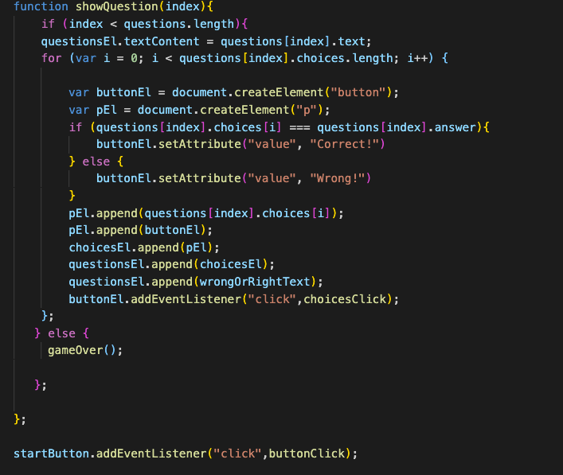
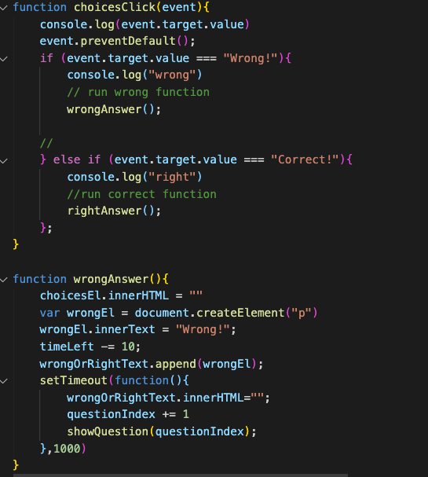
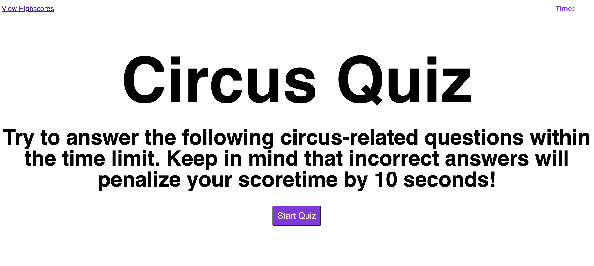
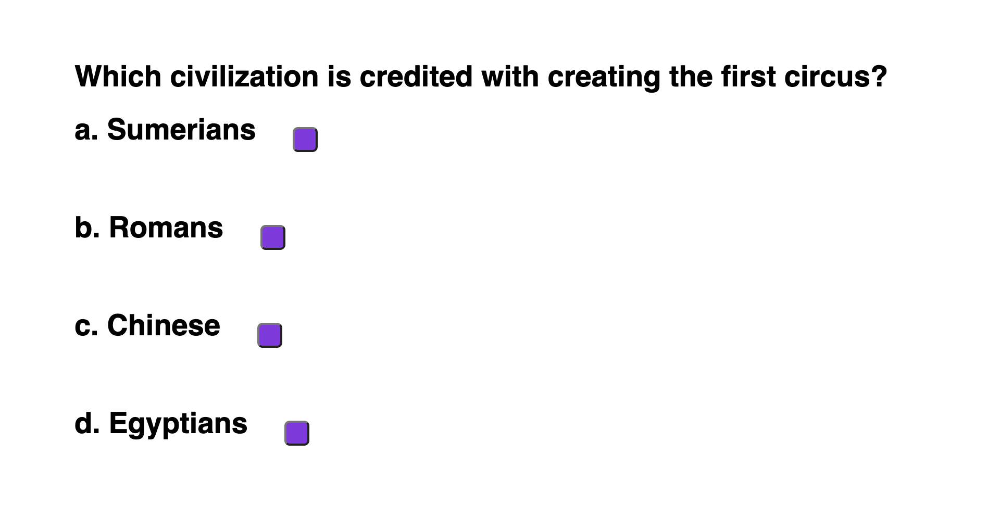
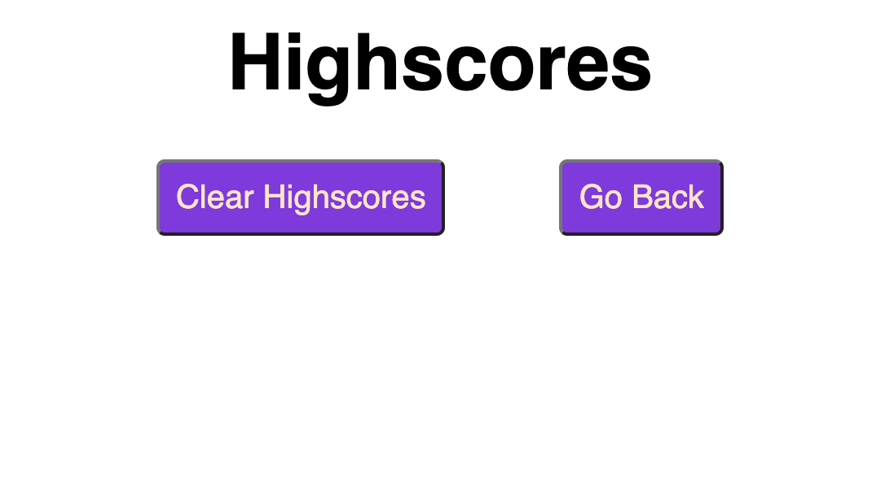

# Quiz_Your_Code

## Description
Here we attempt to build a mulitiple choice quiz.  Once you click the start button the timer begins and the first question displays.  If you get the question right, then you get 10 seconds added to your time.   If you answer the question incorrectly, then your time has 10 seconds removed.  Once you answer all questions your score is recored and stored.  You are moved to a new page to enter your name, and see if you join the list of highscores.  Once you finish you can start the game over, or you can clear the full list of highscores.   

## Link to project 
[Quiz_Your_Code](https://lauragwendolynburch.github.io/Quiz_Your_Code/)

## Sample of JavaScript

## Sample of Project 

## User Notes
 I would like to add more circus fun to the style of this quiz. I will revisit this and make it so you also can not inspect the window and see the answers to the code. When the final question shows I would like to find a way to make it go away and just present the score.  I was also not yet able to get the highscores to save.   

## License
N/A